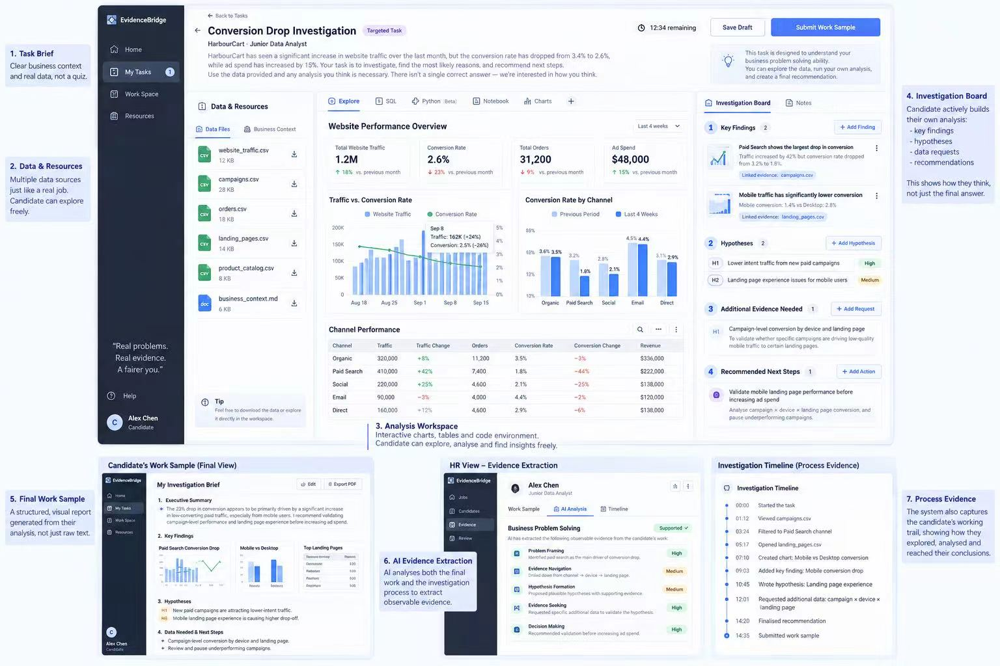
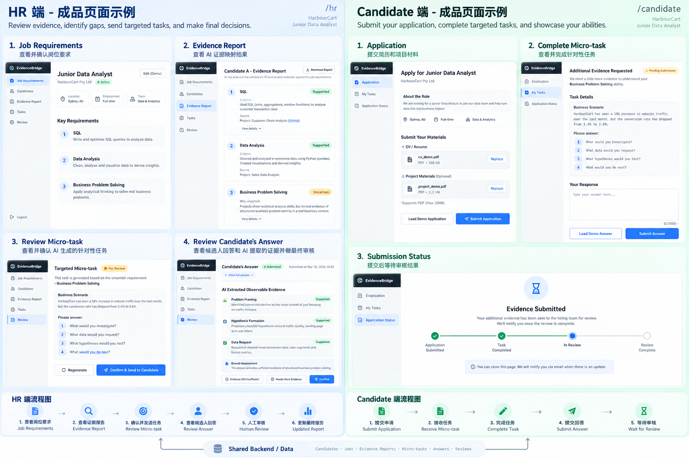

# EvidenceBridge UI / Product Baseline

> **当前演示范围（2026-09-20）**：仅 Harbour Retail 与 Amy Chen、Ann Li、David Liu、Jamie Parker；公开共享交互，无登录入口。旧链接进入当前四人选择页，旧 API3 浏览器草稿／回执不进入当前产品。保留当前作品、评分及审核；下文旧阶段内容仅为历史记录。详见[当前公开演示](../PUBLIC_DEMO.md)。

> API 2.0 连接版执行边界：版本最多 V1 + 一次 V2，只有 V1 补证审核开放 V2；任务、资源、指标和报告以服务端响应为准。预设申请资料不视为真实上传；私人笔记不进入 API。既有独立模拟流程保留于显式 standalone 模式；详见 [前端接入交接](../FRONTEND_API_HANDOFF.md)。

> **最新目标为修订 5：**四人共用流程、评估标准与原文解释、Mark／NE、规则百分比、同技能比较和独立人工保留已批准，后续按两份实施清单增量完成。下方单 Alex／无评分等旧范围仅描述当前基础，不是新版限制；本 PR 先交付 API 2.0 接入，不声称已完成四人版本。

## Repository References / 仓库引用

本文件是两端共享的 UI 与交互基线；产品流程见 [Product Blueprint](EvidenceBridge_PRODUCT_BLUEPRINT.md)，技术决策与实施安排见 [项目计划](../../PROJECT_PLAN.md)，开发规则见 [AGENTS.md](../../AGENTS.md)。HR 与 Candidate 分别设计实现，同时遵守本基线。

### Concept 1 — Candidate task workspace / 候选人核心工作台

### Concept 2 — Dual-role flow / HR 与 Candidate 双端流程

### Reference boundaries / 参考边界

- 图 1 用于核心工作台的布局、密度和模块参考；图 2 用于双端页面与流程参考。外围编号、中文说明和示意连线不作为产品界面内容。
- 已知图文差异以本文件的明确规范为准：共享随日夜主题变化的侧栏；按 2026-09-19 用户新要求，双端统一黑金／白金强调色，默认夜间，保留明确状态语义。
- 候选人主要输入采用图 1 的结构化 Investigation Board，不采用图 2 的单一大文本框任务页。
- 图 2 的 Shared Backend / Data 本身只表达共享数据关系；当前正式任务/V1/V2/审核以已确认修订 3 的共享 API 为准，辅助模拟须明确标识。
- 图片中的个人、公司和数据用于概念演示，不作为真实候选人评价或运行结果。其他实质冲突先确认，不自行改变产品要求。

## 当前执行范围：修订 3 有限两版（2026-09-19）

用户已确认本节覆盖早期仅前端模拟/单轮约定；视觉布局、主题、调查板与固定人物场景继续保留。正式任务、作品、分析、审核与报告使用共享 API 2.0；下面保留的前端展示优先原则不把正式双端同步降回各自 localStorage。实现结果与联调完成情况以[实际测试](../backend/TEST_RESULTS.md)为准，不由文档更新推断。

- 一个 HarbourCart / Junior Data Analyst / Alex Chen 案例、三个要求、Business Problem Solving 一个缺口、同一 Conversion Drop Investigation 与 datasetVersion。
- V1 可直接 Confirm 或 Evidence Still Insufficient 终局；仅 V1 Needs More Evidence 提供具体缺证意见，并开放同 session/task 的一次 V2。V2 只允许 Confirm / Evidence Still Insufficient；不开放 V3 或重开原审核。
- V1 More 后目标仍 Uncertain，状态为 awaiting_revision。Candidate 看到真实 comment、在隔离的 V2 草稿补充；V1 正式作品和既有分析/审核保持不变，不重新出题/更换资源或从头重做。
- V2 创建独立 submissionId/指纹，analysis 初始 not_started、review=null。最多两版作品及各自分析/意见只读回看；引用先选版本再定位，旧观察不显示为 V2 结果。
- UI 读取 workflow.canSubmit/canResubmit/nextSubmissionVersion/allowedReviewDecisions/isTerminal 控制动作；remainingSubmissions 只是额度，不代表终局后仍可提交。
- 只有当前版人工 Confirm 更新目标要求；SQL 与 Data Analysis 保持初始支持。两种不足仍 Uncertain，提交/AI 成功不自动确认，不构成录用决定。
- 申请/初始报告/任务仍明确 preset；AI 仅做各版工作样本五维观察。保留上传外观时不把任意本地文件伪装成已被预置报告分析。私人 notes 留本地；真实模型实验与双端浏览器验收分别记录。

固定两版只读回看属于本轮；无限轮次、复杂 diff、通用历史、PDF/OCR、动态出题、账号/多租户、通知与公网部署仍后置。见[实施计划](../backend/REVISION_PLAN.md)、[API](../backend/API.md)与[前端接入](../backend/HANDOFF.md)。

---

> **Purpose**: This file is the shared implementation baseline for the HR and Candidate sides of EvidenceBridge. Both sides may be developed in parallel, but they must look and behave like two roles inside the same product.
>
> **Priority rule**: This MVP is a browser-based Web Application built for hackathon presentation. Front-end fidelity, clarity, interaction quality, and demo reliability are the primary acceptance criteria. Production backend completeness is not required. Fixed demo data, mocked state, static JSON, pre-generated outputs, and front-end-only interactions are acceptable when they make the intended product behavior clear.

---

## 0. MVP Delivery Constraint — Web Application, Presentation First

EvidenceBridge MVP must be implemented and presented as a **browser-based Web Application**. It is **not** a native desktop application, Electron app, or mobile app. The expected demo format is a polished web product that can be opened in a browser and presented directly to hackathon judges.

### Primary acceptance standard

The MVP is successful when it can convincingly demonstrate the intended product experience to the organizers / judges from beginning to end.

This means the implementation should prioritize:

- Complete and believable front-end flows
- High visual fidelity to the supplied concept images
- Clear HR / Candidate role separation within one product
- Strong interaction feedback and state transitions
- A polished Candidate task workspace
- A polished HR evidence review experience
- Stable demo behavior in the browser

### Backend is explicitly non-blocking

Production backend completeness is **not** an acceptance requirement for this MVP. Do not spend hackathon time building infrastructure that does not improve the visible demo.

Allowed and encouraged for the demo:

- Static JSON / TypeScript demo data
- Local browser state
- Preloaded candidate materials
- Fixed charts and tables
- Simulated file opening / data exploration
- Deterministic process timelines
- Pre-generated AI outputs
- Mocked loading states and transitions
- Labelled front-end-only visual previews; formal cross-role V1/V2 workflow state comes from the shared API

The approved lightweight API and SQLite persistence support formal V1/V2 evidence handoff. Authentication platforms, production file pipelines and production-grade orchestration remain outside this scope.

### Implementation rule

When there is a trade-off between:

`backend completeness` **vs** `front-end clarity / polish / demo reliability`

choose **front-end clarity / polish / demo reliability**.

---

## 1. Product Identity

EvidenceBridge is an **evidence-gap closure workflow for hiring**.

The product does not primarily score candidates. It identifies capabilities that are **not sufficiently proven by existing candidate materials**, gives the candidate a **targeted realistic work-sample task**, captures **observable evidence** from both the process and final output, and lets HR make the final human review.

### Core loop

`Existing evidence -> Evidence gap -> Targeted micro-task -> Observable evidence -> Human review -> Updated evidence report`

This loop is the product core. All visual and interaction decisions should reinforce it.

---

## 2. Shared Product Structure

EvidenceBridge has two roles:

- **HR**: review evidence, identify uncertainty, send targeted tasks, review new evidence, update the evidence report.
- **Candidate**: submit application materials, receive a targeted task, work through a realistic analysis environment, submit a work sample, wait for review.

Both sides must feel like one product.

### Shared shell

All major screens use:

- **Theme-aware left sidebar**
- **Day / night main content area**, with a shared two-state theme switch
- Consistent typography
- Consistent spacing scale
- Consistent component shapes
- Shared status semantics
- Shared EvidenceBridge branding

The role is communicated through accent color, navigation content, and task context—not by creating two unrelated visual systems.

---

## 3. Visual Direction

The visual direction should closely follow the two concept images supplied for the MVP:

1. **Core Candidate task workspace concept**: dense professional workbench, dark sidebar, pale workspace, multiple panels, data cards, charts, resources, structured investigation board, final work sample, HR evidence extraction, process timeline.
2. **Dual-role flow concept**: HR side and Candidate side share the same product shell but have distinct role accent colors.

### Overall feel

The product should look like:

- Professional B2B SaaS
- Analytical / evidence-driven
- Calm, precise, trustworthy
- Dense enough to feel like a real working environment
- Not playful
- Not a generic AI chatbot
- Not a quiz site
- Not a recruitment ATS clone

---

## 4. Role Accent Colors

The shell is shared. Role accents are different.

### Shared neutrals

Neutral tokens follow the active mode: dark sidebar `#0C0F11` and light sidebar `#FFFDF7`, with layered charcoal or warm white surfaces. The current source of truth is `app/shared/tokens.css`.

### Shared gold accent (HR and Candidate)

User-approved update, 2026-09-19: both roles use coordinated gold accents. Role labels and navigation distinguish HR and Candidate. The previous blue/emerald role split is superseded.

- Dark: near-black sidebar `#060606`, charcoal page `#181A1C`, graphite reading surface `#2B2D2F`, warm text `#F4EFE2`, metallic gold `#DBB85C`. The third visual direction retains fine gold borders and stable metallic button highlights; the subsequent contrast revision adds warm gold ambient light and lightly frosted outer panels. Tables, inputs and long quotations retain solid reading backgrounds. Use opaque panel fallbacks when backdrop blur is unsupported.
- Light: warm white page `#F6F3EC`, surface `#FFFEFA`, dark text `#29251D`, gold fill `#C79539`, readable gold link `#805713`.
- Navigation, primary actions, focus rings, selected tabs and analytical charts share these tokens. Historical chart bars use a distinct muted hue and stripe pattern.
- Success, warning and danger remain semantic states; gold alone does not establish a reviewed or verified outcome.
- No saved preference defaults to night mode regardless of OS. Explicit light/dark choices persist using the existing key.
- Exact tokens and compatibility aliases are maintained in [shared UI](../../app/shared/README.md).

---

## 5. Status System

Status meaning must be identical across both sides.

### Evidence status

- **Supported**: green
  - use shared `--success-text` / `--success-bg`
- **Uncertain**: amber
  - use shared `--warning-text` / `--warning-bg`
- **Gap**: red
  - use shared `--danger-text` / `--danger-bg`
- **Verified through targeted task**: strong green
  - use shared success colors; retain the explicit verification label

### Workflow status

- Draft: neutral gray
- Pending / For Review: amber
- Sent: gold
- Submitted: gold
- In Review: gold
- Review Complete: green
- Needs More Evidence: amber
- Evidence Still Insufficient: red / muted red

Status color semantics must never be changed independently by one side.

---

## 6. Typography

Preferred:

- `Inter`

Fallback:

- `system-ui, -apple-system, BlinkMacSystemFont, "Segoe UI", sans-serif`

### Type scale

- Page title: 28–32px / 700
- Section title: 20–24px / 700
- Card title: 16–18px / 600–700
- Body: 14–16px / 400–500
- Caption / metadata: 12–13px / 400–500
- KPI number: 24–30px / 700

### Tone

Use concise, product-like language.

Avoid:

- Long explanatory paragraphs inside cards
- Marketing slogans in core workflow screens
- Casual or playful microcopy

---

## 7. Layout System

### Desktop-first

The hackathon demo should be optimized for desktop presentation.

Recommended frame:

- Sidebar: `232px` expanded / `64px` collapsed; drawer navigation at `700px` and below
- Main content: fluid
- Max content width for standard pages: `1280–1440px`
- Workspace screens may use full width
- Page padding: `24–32px`
- Card gap: `16–20px`

### Sidebar

Shared sidebar: light in day mode, dark in night mode.

Contains:

- EvidenceBridge logo / wordmark
- Role navigation
- Help / support near bottom
- User identity block near bottom

Active item:

- HR side: gold-accented
- Candidate side: gold-accented

Sidebar must remain visually stable across pages. Both roles use the shared Sidebar, theme switch and semantic palette in [app/shared](../../app/shared/README.md). Keep role-specific navigation and business state in each app.

### Day / night behavior

- Day mode uses a light sidebar and pale workspace; night mode uses dark sidebar and layered surfaces.
- HR and Candidate share gold accents; role labels stay distinct and evidence status meanings remain identical.
- The sun / moon sliding switch sits at the bottom of the sidebar, above help and user information, and remains usable when collapsed or in the mobile drawer. Follow system appearance until the user explicitly chooses; persist that choice when storage is available.
- Theme applies to forms, dialogs, tables, charts, tooltips and empty states. Changing appearance must not reset task drafts or review outcomes.
- Desktop collapse preserves icon labels, active state and counts. Mobile navigation is a dismissible drawer with focus management.
- Numeric scoring is deferred pending a separate discussion of what is being assessed; existing human-review actions are unchanged.

---

## 8. Shared Component Standard

Both roles should use the same base components.

### Core components

- `AppShell`
- `Sidebar`
- `PageHeader`
- `SectionHeader`
- `Card`
- `MetricCard`
- `StatusBadge`
- `Button`
- `Tabs`
- `Table`
- `FileRow`
- `Timeline`
- `EvidenceItem`
- `EmptyState`
- `ProgressStepper`
- `Drawer / DetailPanel`
- `Textarea / StructuredInput`
- `InsightCard`

### Radius

- Main cards: `12px`
- Small cards / inputs: `8px`
- Buttons: `8px`
- Badges: pill / `999px`

### Shadow

Use subtle shadows only.

- Default card: border + very light shadow
- Avoid large floating / glossy shadows

### Buttons

- Primary: filled role accent
- Secondary: white / soft surface with border
- Ghost: no fill
- Destructive: red, only where necessary

Do not invent different button shapes per side.

---

## 9. Candidate Side Baseline

### Main Candidate navigation

Suggested:

- Home
- My Tasks
- Workspace
- Resources
- Application Status

For the MVP, not every navigation item needs full backend functionality. The visual shell should still be complete.

### Candidate pages

#### A. Application

Purpose: submit initial evidence.

Must show:

- Role title
- Company
- Role metadata
- CV / Resume upload block
- Project Material upload block
- `Load Demo Application`
- `Submit Application`

Demo uploads may be preloaded / mocked.

#### B. Targeted Task Workspace — **Product Core**

This is the most detailed page in the entire MVP and should visually resemble the first concept image.

Recommended layout:

- Left: Data & Resources
- Center: Analysis Workspace
- Right: Investigation Board
- Top: Task Brief + timer / draft / submit controls

##### 1. Task Brief

Must show:

- Task title
- Targeted Task badge
- Company + role
- Business scenario
- What the candidate is expected to investigate
- Optional time remaining
- Save Draft
- Submit Work Sample

This should feel like a real work brief, not a test question.

##### 2. Data & Resources

Must show multiple realistic resources, for example:

- `website_traffic.csv`
- `campaigns.csv`
- `orders.csv`
- `landing_pages.csv`
- `product_catalog.csv`
- `business_context.md`

Each row may include:

- File type icon
- Filename
- File size
- View / download affordance

The files can be static demo assets.

##### 3. Analysis Workspace

Must visually communicate active analysis.

Recommended content:

- KPI cards
  - Total Website Traffic
  - Conversion Rate
  - Total Orders
  - Ad Spend
- Traffic vs Conversion chart
- Conversion by Channel chart
- Channel performance table
- Tabs such as:
  - Explore
  - SQL
  - Python (Beta)
  - Notebook
  - Charts

For MVP, only `Explore` must look fully finished. Other tabs may be front-end-only states.

##### 4. Investigation Board

This is the main structured interaction area.

Required sections:

- **Key Findings**
- **Hypotheses**
- **Additional Evidence Needed**
- **Recommended Next Steps**

Candidate should be able to add / edit cards in these sections.

Each card may show:

- Title / statement
- Supporting evidence
- Evidence link / source tag
- Priority / confidence tag when useful

This board is the preferred micro-task interaction format.

##### 5. Final Work Sample

The system should present a polished final output generated from the candidate’s work.

Suggested sections:

- Executive Summary
- Key Findings
- Hypotheses
- Data Needed
- Recommended Next Steps

The final work sample can be assembled from fixed demo data or current board state.

##### 6. Process Evidence Timeline

Show the working process visually.

Example events:

- Started the task
- Viewed `campaigns.csv`
- Filtered Paid Search
- Opened `landing_pages.csv`
- Created chart
- Added key finding
- Added hypothesis
- Requested additional data
- Finalised recommendation
- Submitted work sample

For MVP, timestamps and events may be deterministic / mocked.

### Candidate Submission Status

Show a horizontal progress flow:

- Application Submitted
- Task Received / Task Completed
- In Review
- Review Complete

This page should be simple and calm.

---

## 10. HR Side Baseline

### Main HR navigation

Suggested:

- Job Requirements
- Candidates
- Evidence Report
- Tasks
- Review

### HR pages

#### A. Job Requirements

Must show:

- Company
- Role title
- Role metadata
- Key requirements

Demo requirements:

1. SQL
2. Data Analysis
3. Business Problem Solving

Each requirement should include a short capability statement.

#### B. Evidence Report

This page should be more detailed than the second concept image, but still easy to scan.

Each requirement card should include:

- Requirement title
- Status badge
- Evidence summary
- Source
- Explanation
- If uncertain: why uncertain

Expandable detail may include:

- Evidence snippet
- Source material
- Mapping rationale
- Remaining uncertainty

The report must make it obvious why a targeted micro-task is needed.

#### C. Review Micro-task

Must show:

- Target requirement
- Why this requirement is uncertain
- Generated task title
- Business scenario
- Candidate instructions

Actions:

- Regenerate
- Confirm & Send to Candidate

#### D. Review Candidate Work Sample — **HR Core Review**

Must show three evidence layers.

##### Layer 1: Final Work Sample

Show candidate output:

- Executive Summary
- Key Findings
- Hypotheses
- Recommended Next Steps

##### Layer 2: Process Evidence

Show the timeline / working trace.

##### Layer 3: AI Extracted Observable Evidence

Recommended capability dimensions:

- Problem Framing
- Evidence Navigation
- Hypothesis Formation
- Evidence Seeking
- Decision Making

Each dimension should show:

- Observable evidence statement
- Supporting source / action
- Strength label such as High / Medium / Supported

Do **not** turn the product into a numeric ranking system.

Review actions:

- Confirm
- Needs More Evidence (V1 only; one V2 revision)
- Evidence Still Insufficient

V2 exposes only Confirm and Evidence Still Insufficient. Historical V1/V2 work, observations and decisions are read-only.

#### E. Updated Evidence Report

Must visually demonstrate the closed loop.

Example:

- Before: `Business Problem Solving — Uncertain`
- After: `Business Problem Solving — Verified through targeted task`

Also show:

- New evidence
- Evidence source = targeted task
- Human review state
- Remaining uncertainty if any

This screen should make the product value immediately understandable.

---

## 11. Micro-task Interaction Standard

The micro-task should **not** be implemented as only a large text box.

Preferred interaction:

1. Realistic business scenario
2. Data / resource set
3. Analysis workspace
4. Structured Investigation Board
5. Final work sample
6. Process evidence capture

This creates evidence of **how the candidate thinks**, not just the final answer.

The Investigation Board should remain the main candidate input surface.

---

## 12. Evidence Report Detail Standard

### Initial Evidence Report

Organized by **job requirement**:

- Requirement
- Status
- Evidence
- Source
- Explanation
- Why uncertain / remaining uncertainty

### Post-task Review

Organized by **observable capability dimension**:

- Problem Framing
- Evidence Navigation
- Hypothesis Formation
- Evidence Seeking
- Decision Making

This distinction is intentional:

- Before the task: “What requirement is proven?”
- After the task: “What behavior did we actually observe?”

---

## 13. Front-end First Rule

For the hackathon MVP:

### Front-end must be convincing

It should visually show the intended product behavior even when the underlying logic is mocked.

Allowed:

- Fixed candidate data
- Fixed role data
- Preloaded charts
- Preloaded resources
- Mocked timestamps
- Pre-generated AI evidence
- Local state
- Static JSON
- Demo buttons such as `Load Demo Application`

### Backend is secondary

Do not spend disproportionate time on:

- Authentication
- Production database design
- Multi-tenant architecture
- Complex permissions
- Real file ingestion pipeline
- Full SQL / Python execution environment
- Production analytics engine
- Full AI orchestration

Labelled visual simulations may support the demo; formal V1/V2 submission, feedback and final report acceptance require the shared API workflow described above.

---

## 14. Demo Data Baseline

Use one fixed scenario across both sides.

### Company

HarbourCart Pty Ltd

### Role

Junior Data Analyst

### Requirements

1. SQL
2. Data Analysis
3. Business Problem Solving

### Initial mapping

- SQL -> Supported
- Data Analysis -> Supported
- Business Problem Solving -> Uncertain

### Targeted task

**Conversion Drop Investigation**

Scenario:

- Website traffic increased by 18%
- Conversion rate dropped from 3.4% to 2.6%
- Ad spend increased by 15%

Goal:

Investigate likely causes and recommend next steps.

---

## 15. Cross-team Contract

Both developers / AI coding agents must follow this file.

### Do not independently change

- Sidebar style
- Role colors
- Status colors
- Typography
- Card radius
- Core navigation naming
- Requirement names
- Evidence status naming
- Targeted task scenario
- Capability dimension naming
- Main page structure

### Allowed to vary

- Internal component implementation
- Mock state implementation
- Local file organization
- Small spacing adjustments when required
- Non-visible technical choices

### If a visual decision is not covered here

Default to the supplied concept images rather than inventing a new style.

---

## 16. Definition of Visual Success

The two independently developed sides should pass these checks:

- Put HR and Candidate screenshots side by side: they obviously belong to the same product.
- The HR side feels like an evidence review dashboard.
- The Candidate side feels like a realistic work-sample workspace.
- The Candidate targeted task is the most visually complete part of the MVP.
- The evidence gap -> targeted task -> new evidence -> human confirmation loop is immediately understandable.
- No screen should look like a generic AI chat interface or a quiz form.

## 2026-09-19 修订5本地后端实施补充

以已合并 PR7 `e9d6de6` 为基线保留 API2 前端。本地新增 API3 四人独立状态、SQL/DA/BPS固定模板、有限V1/V2、十项rubric确定性计算、分阶段评估历史与人工名单；证据review、assessment、shortlist彼此独立。公司与材料为合成fixture，预置评估实际由AI编写/交叉审查，真人校准待完成。不把这份实现当作生产鉴权、真实模型效果或新版双端已联调。

新入口 `npm start --prefix app/backend` 运行API3（默认新库v3）；已合并两端继续用 `npm run start:legacy --prefix app/backend` 的API2并显式核对v2路径。请先进入 `app/backend` 复制/核对环境示例，避免旧 `.env` 路径影响合同切换。API3 GET 必选candidateId，不静默默认Alex；正式演示库不自动迁移。来源和流程以[新版后端交接](../backend/R5_HANDOFF.md)为准，旧段落表示API2阶段。

新增检查：`npm run test:r5 --prefix app/backend`；`npm run docs:generate --prefix app/backend` 生成API3，`npm run docs:generate:legacy --prefix app/backend` 保留API2；`node app/backend/scripts/verify-r5.mjs` 用独立临时库跑进程级HTTP/重启/迁移。迁移CLI强制source/destination/backup显式路径，执行前另外确认目标，禁止直接替换演示库。本轮新增发布、合并、部署均未执行。

## 2026-09-19 双端本地整合补充

基于PR9前端与本地修订5后端新增真实API3模式，保留原页面成果。默认 `api3-connected` 匹配后端默认3.0；显式 `connected` 仍用于旧API2，`revision5-preview` 仍是独立本地模拟。旧段落中的“新版待接入”是此前阶段记录，当前行为以[API3整合交接](../FRONTEND_API3_INTEGRATION.md)为准。新检查 `python3 scripts/frontend-types-v3.py --check` 与 `npm run test:api3 --prefix app/candidate`；各命令从仓库根执行。API3浏览器用独立端口与临时SQLite，普通页面不持有reset令牌。此轮未提交、推送、合并或部署；实际验收状态以本轮报告为准。

## 2026-09-20 local frontend structure update

The current API4 repair worktree separates page responsibilities and replaces repeated top-level demo panels with a compact status/header and Workspace info. Candidate details owns assessment, source/JD and history sections; Tasks & review owns task dispatch and evidence review, with explicit version-bound assessment navigation. Retained list shows saved selections instead of repeating the whole comparison list. Business rules and data are unchanged. See [page structure and regression scope](../FRONTEND_PAGE_STRUCTURE.md). This note describes local implementation, not a GitHub merge or public deployment.
